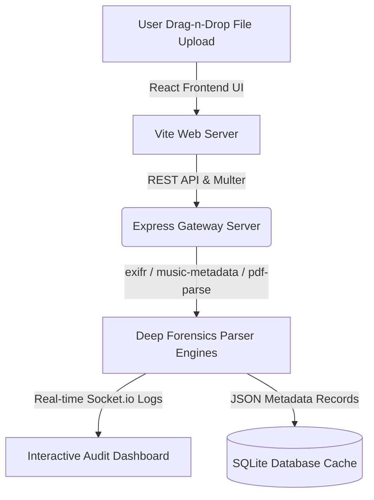
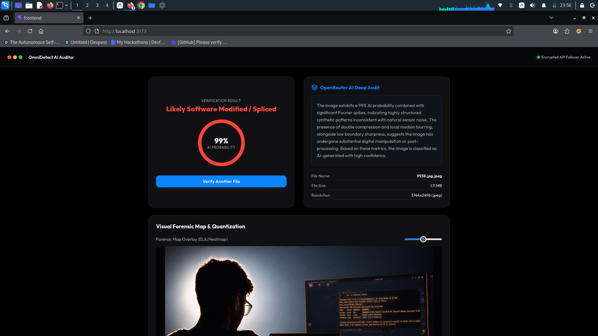
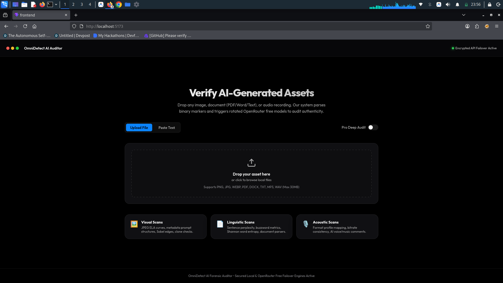
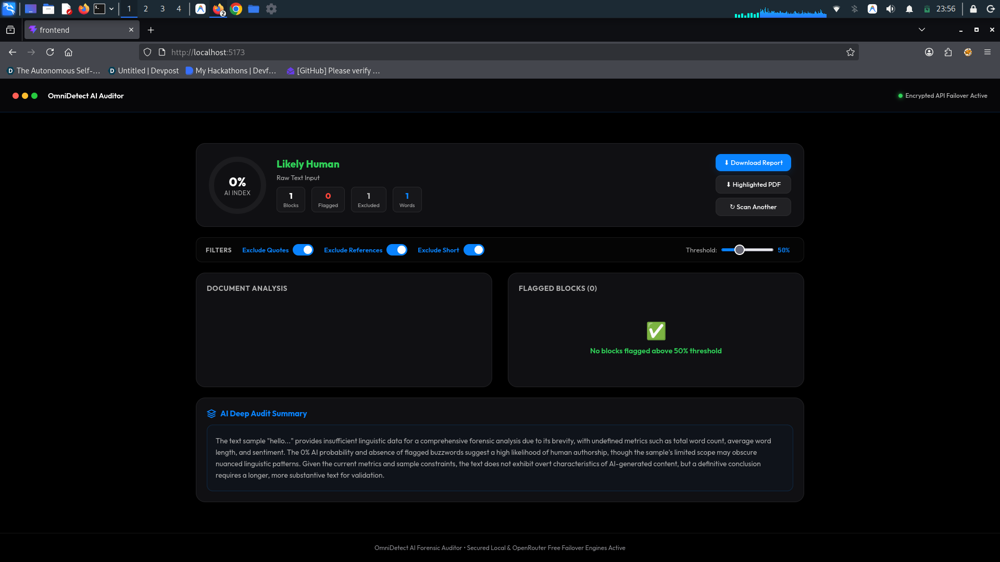

# 🕵️‍♂️ OmniDetect AI: Full-Stack Media Metadata Forensics & AI Detection Platform

[](https://opensource.org/licenses/MIT)
[](https://nodejs.org/)
[](https://react.dev/)
[](https://vitejs.dev/)
[](https://sqlite.org/)

An advanced, full-stack cybersecurity forensics and media telemetry platform designed to extract deep metadata parameters, geo-coordinates, structure anomalies, and editing traces from uploaded files. **OmniDetect AI** provides a unified diagnostic pipeline for images, audio tracks, PDFs, and Word documents, alerting auditors to potential manipulation.



---

## 🖥️ Platform Previews

<p align="center">
  
  <br />
  <em>Figure 1: Main Forensics Dashboard workspace containing the drag-n-drop file upload interface.</em>
</p>

<br />

<p align="center">
  
  
  <br />
  <em>Figure 2: AI Detection probability charts (left) and deep file metadata properties inspector (right).</em>
</p>

---

## 🚀 Key Features

*   **Multi-Modal Media Forensics**:
    *   **Images**: Extracts EXIF camera metadata, lens properties, software modifiers, and camera geolocation coordinate pins (`exifr` engine).
    *   **Audio**: Analyzes container headers, bitrate logs, codecs, and audio tag layers (`music-metadata`).
    *   **Documents**: Parses document revisions, author metadata, edit counts, and text strings from PDFs (`pdf-parse`) and Word files (`mammoth`).
*   **Real-time WebSocket Logs**: Integrated Socket.io messaging pipeline pushing scanning steps and audit progress statistics instantly to the client.
*   **Frosted Glassmorphic Dashboard**: Modern, Apple-style React dashboard UI featuring file upload dropzones, circular progress meters, and dynamic metadata property tables.
*   **Structured Local Storage**: Keeps record logs and transaction history saved in a high-performance SQLite database (`better-sqlite3`).

---

## 🛠️ Tech Stack

| Module | Core Technology | Role |
| --- | --- | --- |
| **Frontend HUD** | React / Vite | Interactive drag-and-drop audit workspace. |
| **Backend API** | Node.js / Express | Handlers for file uploads and stream pipelines. |
| **Database** | SQLite (`better-sqlite3`) | Persistent audit trails and logs records. |
| **WebSocket** | Socket.io | Real-time scan telemetry transmission. |

---

## 📥 Getting Started

### Prerequisites

*   **Node.js (>= 18.0.0)**
*   **npm**

### Quick Start Installation

We provide unified commands to install packages across the root, frontend, and backend folders automatically.

```bash
# 1. Clone the repository
git clone https://github.com/sudonishant/omnidetect-ai.git
cd omnidetect-ai

# 2. Run the automated setup tool to install all directories dependencies
npm run install:all

# 3. Spin up both backend and frontend servers concurrently in dev mode
npm run dev
```

Open **[http://localhost:5173](http://localhost:5173)** in your browser to access the interactive forensics dashboard.

---

## 📁 Repository Structure

```text
omnidetect-ai/
├── package.json           # Root task orchestrator (npm run dev)
├── package-lock.json
├── .gitignore             # Ignored directories
├── README.md              # Project documentation
├── backend/               # Express API and sqlite store
│   ├── server.js          # Entrypoint server
│   ├── package.json
│   ├── config/            # DB settings
│   ├── data/              # SQLite cache database
│   └── services/          # EXIF & PDF parse utilities
└── frontend/              # React & Vite client
    ├── index.html         # Main dashboard template
    ├── vite.config.js     # Dev proxy rules
    ├── package.json
    └── src/
        ├── app.jsx        # Client rendering entry
        └── components/    # Telemetry dials and property tables
```

---

## 📄 License

Distributed under the MIT License. See [LICENSE](LICENSE) for details. Created by [sudonishant](https://github.com/sudonishant).
